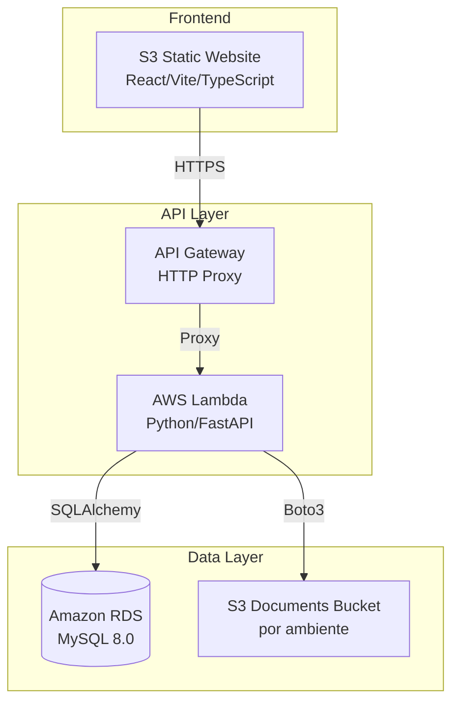
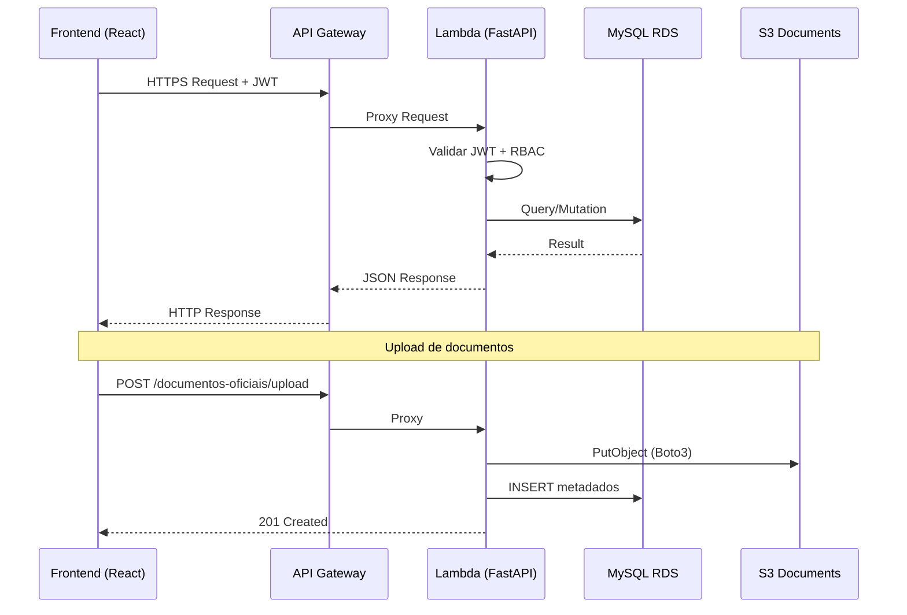
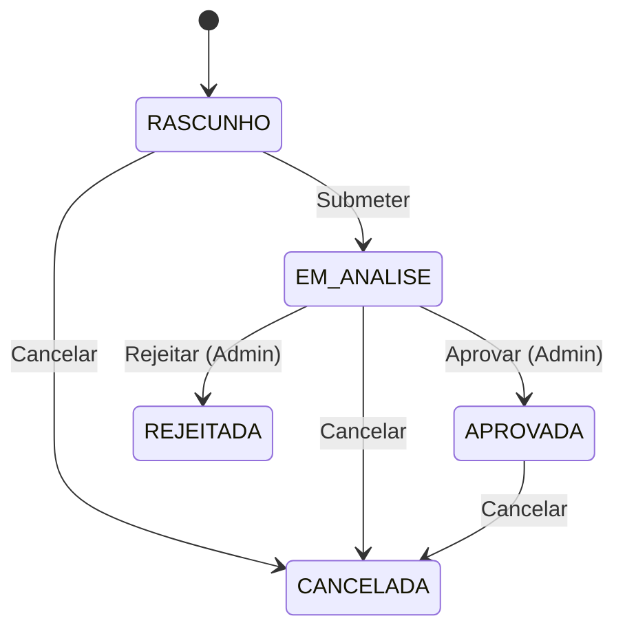
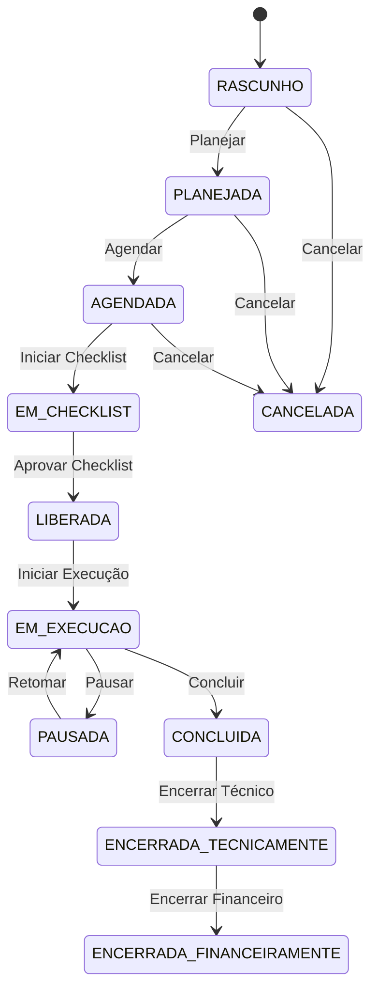
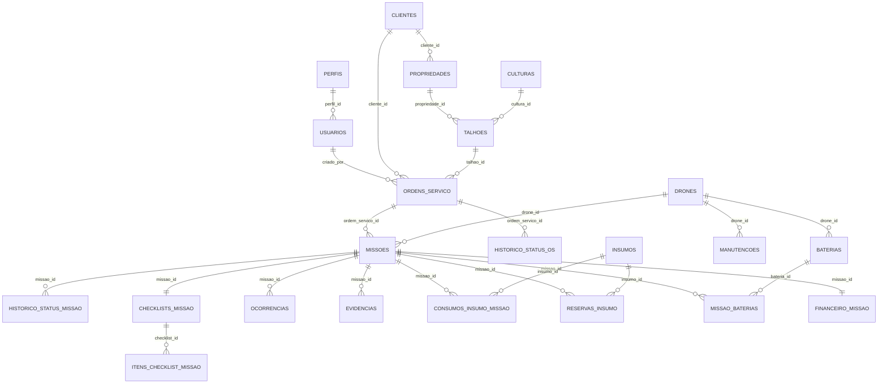

# Documento de Design — AgroFlightOps MVP

## Visão Geral

O AgroFlightOps é um sistema web completo para gestão de operações de pulverização agrícola com drones. O MVP implementa o ciclo operacional completo: desde o cadastro de clientes e propriedades, passando pela criação e aprovação de ordens de serviço, planejamento e execução de missões de voo, até o encerramento técnico/financeiro com relatórios consolidados.

A arquitetura segue o modelo serverless na AWS, com frontend React/Vite/TypeScript servido como site estático no S3, backend Python/FastAPI executado em AWS Lambda via API Gateway, banco de dados MySQL 8.0 no Amazon RDS e armazenamento de documentos em buckets S3 segregados por ambiente.

### Decisões Arquiteturais Chave

1. **Serverless-first**: Lambda + API Gateway elimina gestão de servidores e escala automaticamente com a demanda
2. **Schema-first**: O DDL MySQL já existe e define todas as tabelas, constraints e índices — o backend é construído sobre esse schema
3. **RBAC via JWT**: Controle de acesso baseado em perfis (Administrador, Piloto, Técnico, Financeiro, Coordenador_Operacional) com tokens JWT
4. **Soft-delete universal**: Todas as entidades usam campo `ativo` para exclusão lógica, preservando integridade referencial
5. **Auditoria centralizada**: Tabela `auditoria` registra todas as alterações críticas com valor anterior/novo em JSON

## Arquitetura

### Diagrama de Arquitetura



### Fluxo de Requisição



### Camadas da Aplicação

| Camada | Responsabilidade | Tecnologia |
|--------|-----------------|------------|
| Apresentação | UI, formulários, dashboards, navegação | React, TypeScript, Vite, Ant Design/MUI |
| API | Roteamento, validação, serialização | FastAPI, Pydantic |
| Serviço | Lógica de negócio, regras de transição de status, RBAC | Python |
| Repositório | Acesso a dados, queries, paginação | SQLAlchemy, aiomysql |
| Infraestrutura | Persistência, armazenamento, autenticação | MySQL 8.0, S3, JWT |

## Componentes e Interfaces

### Backend — Estrutura de Diretórios

```
app/
├── api/                          # Rotas FastAPI (controllers)
│   ├── auth.py                   # POST /auth/login, POST /auth/refresh
│   ├── usuarios.py               # CRUD /usuarios
│   ├── clientes.py               # CRUD /clientes
│   ├── propriedades.py           # CRUD /propriedades
│   ├── talhoes.py                # CRUD /talhoes
│   ├── culturas.py               # CRUD /culturas
│   ├── drones.py                 # CRUD /drones
│   ├── baterias.py               # CRUD /baterias
│   ├── insumos.py                # CRUD /insumos
│   ├── ordens_servico.py         # CRUD + transições /ordens-servico
│   ├── missoes.py                # CRUD + transições /missoes
│   ├── checklists.py             # Preenchimento e aprovação /checklists
│   ├── ocorrencias.py            # CRUD /ocorrencias
│   ├── evidencias.py             # Upload/download /evidencias
│   ├── manutencoes.py            # CRUD /manutencoes
│   ├── documentos_oficiais.py    # Upload/download /documentos-oficiais
│   ├── financeiro.py             # Encerramento financeiro /financeiro
│   ├── relatorios.py             # Endpoints de relatórios /relatorios
│   └── auditoria.py              # Consulta /auditoria
├── services/                     # Lógica de negócio
│   ├── auth_service.py           # Autenticação, JWT, bcrypt
│   ├── usuario_service.py
│   ├── cliente_service.py
│   ├── propriedade_service.py
│   ├── talhao_service.py
│   ├── cultura_service.py
│   ├── drone_service.py
│   ├── bateria_service.py
│   ├── insumo_service.py
│   ├── ordem_servico_service.py  # Máquina de estados OS
│   ├── missao_service.py         # Máquina de estados Missão
│   ├── checklist_service.py
│   ├── ocorrencia_service.py
│   ├── evidencia_service.py
│   ├── manutencao_service.py
│   ├── documento_service.py      # Upload S3 + metadados
│   ├── financeiro_service.py
│   ├── relatorio_service.py
│   └── auditoria_service.py
├── repositories/                 # Acesso a dados
│   ├── base_repository.py        # CRUD genérico, paginação
│   └── ...                       # Um repository por entidade
├── models/                       # SQLAlchemy ORM models
│   └── ...                       # Mapeamento 1:1 com tabelas DDL
├── schemas/                      # Pydantic schemas
│   └── ...                       # Request/Response por entidade
├── core/
│   ├── config.py                 # Settings (env vars)
│   ├── database.py               # Engine, SessionLocal
│   ├── security.py               # JWT encode/decode, bcrypt
│   ├── dependencies.py           # get_db, get_current_user, require_perfil
│   └── exceptions.py             # HTTPExceptions customizadas
└── main.py                       # FastAPI app + Mangum handler
```

### Frontend — Estrutura de Diretórios

```
src/
├── api/                          # Axios client + interceptors
│   └── client.ts                 # Base URL, JWT interceptor, refresh
├── auth/
│   ├── AuthContext.tsx            # Context de autenticação
│   ├── ProtectedRoute.tsx        # Guard de rota por perfil
│   └── useAuth.ts                # Hook de autenticação
├── pages/
│   ├── Login.tsx
│   ├── Dashboard.tsx             # Dashboards analíticos
│   ├── Usuarios.tsx
│   ├── Clientes.tsx
│   ├── Propriedades.tsx
│   ├── Talhoes.tsx
│   ├── Culturas.tsx
│   ├── Drones.tsx
│   ├── Baterias.tsx
│   ├── Insumos.tsx
│   ├── OrdensServico.tsx
│   ├── Missoes.tsx
│   ├── Checklists.tsx
│   ├── Relatorios.tsx
│   └── Auditoria.tsx
├── components/                   # Componentes reutilizáveis
│   ├── DataTable.tsx             # Tabela paginada genérica
│   ├── StatusBadge.tsx           # Badge de status colorido
│   ├── FormModal.tsx             # Modal de formulário genérico
│   ├── FileUpload.tsx            # Upload de arquivos
│   ├── GeoLocationPicker.tsx     # Seletor de coordenadas
│   └── Charts/                   # Componentes de gráficos
├── hooks/                        # Custom hooks
├── types/                        # TypeScript interfaces
└── utils/                        # Utilitários (formatação, validação)
```

### Interfaces de API — Endpoints Principais

| Módulo | Método | Endpoint | Perfis Permitidos |
|--------|--------|----------|-------------------|
| Auth | POST | `/auth/login` | Público |
| Auth | POST | `/auth/refresh` | Autenticado |
| Usuários | GET/POST/PUT/PATCH | `/usuarios` | Administrador |
| Clientes | GET/POST/PUT/PATCH | `/clientes` | Administrador, Coordenador_Operacional |
| Propriedades | GET/POST/PUT/PATCH | `/propriedades` | Administrador, Coordenador_Operacional |
| Talhões | GET/POST/PUT/PATCH | `/talhoes` | Administrador, Coordenador_Operacional |
| Culturas | GET/POST/PUT/PATCH | `/culturas` | Administrador, Coordenador_Operacional |
| Drones | GET/POST/PUT/PATCH | `/drones` | Administrador |
| Baterias | GET/POST/PUT/PATCH | `/baterias` | Administrador |
| Insumos | GET/POST/PUT/PATCH | `/insumos` | Administrador, Coordenador_Operacional |
| Ordens de Serviço | GET/POST/PUT/PATCH | `/ordens-servico` | Administrador, Coordenador_Operacional |
| OS — Transições | PATCH | `/ordens-servico/{id}/transicao` | Administrador, Coordenador_Operacional |
| Missões | GET/POST/PUT/PATCH | `/missoes` | Administrador, Coordenador_Operacional, Piloto, Técnico |
| Missões — Transições | PATCH | `/missoes/{id}/transicao` | Administrador, Coordenador_Operacional, Piloto, Técnico |
| Checklists | GET/POST/PATCH | `/missoes/{id}/checklist` | Piloto, Técnico |
| Ocorrências | GET/POST | `/missoes/{id}/ocorrencias` | Piloto |
| Evidências | GET/POST | `/missoes/{id}/evidencias` | Piloto |
| Manutenções | GET/POST/PUT | `/manutencoes` | Administrador, Técnico |
| Documentos | GET/POST | `/documentos-oficiais` | Administrador |
| Documentos — Download | GET | `/documentos-oficiais/{id}/download` | Autenticado |
| Financeiro | GET/POST/PATCH | `/missoes/{id}/financeiro` | Financeiro, Administrador |
| Relatórios | GET | `/relatorios/{tipo}` | Administrador, Financeiro |
| Auditoria | GET | `/auditoria` | Administrador |

### Máquinas de Estado

#### Ordem de Serviço



#### Missão




### Dependência entre Serviços — Regras de Negócio Críticas

| Regra | Serviço | Descrição |
|-------|---------|-----------|
| Transição de status OS | `ordem_servico_service` | Valida transições permitidas, exige motivo para rejeição/cancelamento, registra histórico |
| Transição de status Missão | `missao_service` | Valida transições, altera status do Drone (DISPONIVEL↔EM_USO), registra timestamps |
| Consumo de insumo | `insumo_service` | Valida saldo suficiente antes de debitar, rejeita se saldo ficaria negativo |
| Checklist obrigatório | `checklist_service` | Impede liberação de missão se itens obrigatórios estão REPROVADO |
| Proteção de desativação | Vários services | Impede desativação de entidades com dependências ativas (Cliente com OS, Talhão com OS, Cultura com Talhões, Drone com Missões) |
| Auditoria automática | `auditoria_service` | Registra valor_anterior e valor_novo em JSON para toda operação CUD em entidades principais |
| Documentos vencidos | `documento_service` | Marca status VENCIDO quando data_validade < data atual |
| Substituição de documentos | `documento_service` | Marca documento anterior como SUBSTITUIDO ao enviar novo do mesmo tipo/entidade |

## Modelos de Dados

### Diagrama ER Simplificado



### Entidades Principais e Campos

O schema completo está definido no arquivo `database/AgroFlightOps_RDS_MySQL_ddl.sql`. Abaixo, um resumo das entidades e suas regras:

| Entidade | PK | Campos Chave | Constraints Notáveis |
|----------|----|--------------|-----------------------|
| `perfis` | BIGINT UNSIGNED AI | nome (UNIQUE) | Seed: ADMINISTRADOR, COORDENADOR_OPERACIONAL, PILOTO, TECNICO, FINANCEIRO |
| `usuarios` | BIGINT UNSIGNED AI | email (UNIQUE), perfil_id (FK), senha_hash | ativo BOOLEAN |
| `clientes` | BIGINT UNSIGNED AI | cpf_cnpj, latitude/longitude | CHECK lat [-90,90], lon [-180,180] |
| `propriedades` | BIGINT UNSIGNED AI | cliente_id (FK), area_total | CHECK area_total >= 0 |
| `talhoes` | BIGINT UNSIGNED AI | propriedade_id+nome (UNIQUE), cultura_id (FK), geojson JSON | CHECK area_hectares >= 0 |
| `culturas` | BIGINT UNSIGNED AI | nome (UNIQUE) | ativo BOOLEAN |
| `drones` | BIGINT UNSIGNED AI | identificacao (UNIQUE), status CHECK IN(...) | horas_voadas >= 0, capacidade_litros >= 0 |
| `baterias` | BIGINT UNSIGNED AI | identificacao (UNIQUE), drone_id (FK nullable) | ciclos >= 0, status CHECK IN(...) |
| `insumos` | BIGINT UNSIGNED AI | nome, saldo_atual | CHECK saldo_atual >= 0 |
| `ordens_servico` | BIGINT UNSIGNED AI | codigo (UNIQUE), status CHECK IN(...), prioridade CHECK IN(...) | motivo_rejeicao obrigatório se REJEITADA |
| `missoes` | BIGINT UNSIGNED AI | codigo (UNIQUE), status CHECK IN(...) | finalizado_em >= iniciado_em |
| `checklists_missao` | BIGINT UNSIGNED AI | missao_id (UNIQUE), status_geral CHECK IN(...) | revisado_em >= preenchido_em |
| `itens_checklist_missao` | BIGINT UNSIGNED AI | checklist_id (FK), status_item CHECK IN(...) | observacao obrigatória se REPROVADO |
| `ocorrencias` | BIGINT UNSIGNED AI | missao_id (FK), severidade CHECK IN(...) | — |
| `evidencias` | BIGINT UNSIGNED AI | missao_id (FK), nome_arquivo | lat/lon opcionais |
| `manutencoes` | BIGINT UNSIGNED AI | drone_id (FK), data_manutencao | proxima_manutencao >= data_manutencao |
| `financeiro_missao` | BIGINT UNSIGNED AI | missao_id (UNIQUE), status_financeiro CHECK IN(...) | custos >= 0 |
| `documentos_oficiais` | BIGINT UNSIGNED AI | entidade CHECK IN(...), s3_key, status CHECK IN(...) | data_validade >= data_emissao |
| `auditoria` | BIGINT UNSIGNED AI | entidade, entidade_id, acao, valor_anterior JSON, valor_novo JSON | — |

### Pydantic Schemas — Padrão

Cada entidade terá os seguintes schemas Pydantic:

```python
# Exemplo para Cliente
class ClienteBase(BaseModel):
    nome: str = Field(..., max_length=200)
    cpf_cnpj: str | None = Field(None, max_length=18)
    telefone: str | None = Field(None, max_length=30)
    email: str | None = Field(None, max_length=255)
    # ... demais campos

class ClienteCreate(ClienteBase):
    pass

class ClienteUpdate(BaseModel):
    nome: str | None = None
    cpf_cnpj: str | None = None
    # ... campos opcionais para PATCH

class ClienteResponse(ClienteBase):
    id: int
    ativo: bool
    created_at: datetime
    updated_at: datetime

    class Config:
        from_attributes = True

class PaginatedResponse(BaseModel, Generic[T]):
    items: list[T]
    total: int
    page: int
    page_size: int
    pages: int
```

### Padrão de Resposta Paginada

Todos os endpoints de listagem seguem o padrão:

```json
{
  "items": [...],
  "total": 150,
  "page": 1,
  "page_size": 20,
  "pages": 8
}
```

Parâmetros de query: `page` (default 1), `page_size` (default 20, max 100).

### Segurança — JWT e RBAC

```python
# Estrutura do token JWT
{
  "sub": "usuario_id",
  "perfil": "ADMINISTRADOR",
  "email": "user@example.com",
  "exp": 1234567890,
  "iat": 1234567800
}
```

Middleware de autorização:
- `get_current_user`: Extrai e valida JWT do header `Authorization: Bearer <token>`
- `require_perfil(*perfis)`: Dependency que verifica se o perfil do usuário está na lista permitida
- Senhas armazenadas com `bcrypt` (passlib)


## Propriedades de Corretude

*Uma propriedade é uma característica ou comportamento que deve ser verdadeiro em todas as execuções válidas de um sistema — essencialmente, uma declaração formal sobre o que o sistema deve fazer. Propriedades servem como ponte entre especificações legíveis por humanos e garantias de corretude verificáveis por máquina.*

### Propriedade 1: Round-trip de senha com bcrypt

*Para qualquer* senha válida (string não vazia), ao criar um usuário com essa senha, o hash armazenado deve ser verificável com `bcrypt.verify(senha_original, hash_armazenado) == True`, e o hash nunca deve ser igual à senha em texto plano.

**Valida: Requisitos 1.3, 2.1**

### Propriedade 2: RBAC — Matriz de permissões

*Para qualquer* combinação de (perfil, método HTTP, endpoint), o sistema deve conceder acesso se e somente se o perfil está na lista de perfis permitidos para aquele endpoint. Perfis não autorizados devem receber HTTP 403.

**Valida: Requisitos 1.5**

### Propriedade 3: Credenciais inválidas retornam erro genérico

*Para qualquer* par de credenciais onde email não existe OU senha está incorreta, a API deve retornar HTTP 401 com mensagem idêntica (sem revelar qual campo falhou). A mensagem de erro para email inexistente deve ser indistinguível da mensagem para senha incorreta.

**Valida: Requisitos 1.2**

### Propriedade 4: Usuário desativado não consegue autenticar

*Para qualquer* usuário com campo `ativo=FALSE`, tentativa de login com credenciais corretas deve retornar HTTP 401.

**Valida: Requisitos 1.6, 2.3**

### Propriedade 5: Soft-delete preserva registro

*Para qualquer* entidade principal (Usuário, Cliente, Cultura, Drone, Bateria, Insumo), ao executar desativação, o campo `ativo` deve ser `FALSE` e o registro deve continuar existindo no banco de dados (consultável por ID).

**Valida: Requisitos 2.3, 3.4, 5.3**

### Propriedade 6: Unicidade de identificadores

*Para qualquer* par de registros da mesma entidade, os campos de unicidade devem ser distintos: email em Usuários, cpf_cnpj em Clientes (quando informado), nome em Culturas, identificação em Drones e Baterias, código em Ordens de Serviço e Missões, e (propriedade_id, nome) em Talhões. Tentativa de duplicação deve retornar HTTP 409.

**Valida: Requisitos 2.1, 2.5, 4.2, 5.1, 6.1, 7.1**

### Propriedade 7: Validação de coordenadas geográficas

*Para qualquer* valor de latitude e longitude submetido, o sistema deve aceitar se latitude ∈ [-90, 90] e longitude ∈ [-180, 180], e rejeitar com HTTP 422 caso contrário. Valores nulos devem ser aceitos (coordenadas são opcionais).

**Valida: Requisitos 3.2, 4.1**

### Propriedade 8: Proteção de desativação com dependências ativas

*Para qualquer* entidade que possui dependências ativas (Cliente com OS não-CANCELADA, Talhão com OS não-CANCELADA, Cultura com Talhões ativos, Drone com Missões EM_EXECUCAO ou AGENDADA), a tentativa de desativação deve ser rejeitada com mensagem informativa. Se não houver dependências ativas, a desativação deve ter sucesso.

**Valida: Requisitos 3.5, 4.6, 5.4, 6.6**

### Propriedade 9: Validação de enums de status

*Para qualquer* string submetida como valor de status (Drone, Bateria, OS, Missão, Checklist, Ocorrência, Documento, Financeiro), o sistema deve aceitar apenas os valores definidos no schema e rejeitar qualquer outro valor com HTTP 422.

**Valida: Requisitos 6.2, 7.2, 9.2, 9.3, 10.2, 13.2, 15.3, 16.4**

### Propriedade 10: Máquina de estados de Ordem de Serviço

*Para qualquer* Ordem de Serviço em um dado status, apenas as transições definidas na máquina de estados são permitidas (RASCUNHO→EM_ANALISE, EM_ANALISE→APROVADA, EM_ANALISE→REJEITADA, {RASCUNHO,EM_ANALISE,APROVADA}→CANCELADA). Transições inválidas devem ser rejeitadas. Rejeição deve exigir motivo_rejeicao e cancelamento deve exigir motivo_cancelamento.

**Valida: Requisitos 9.4, 9.5, 9.6, 9.7**

### Propriedade 11: Histórico de transições de status

*Para qualquer* transição de status em Ordem de Serviço ou Missão, o sistema deve criar um registro no histórico correspondente contendo: status_anterior, status_novo, motivo (quando aplicável) e alterado_por. O número de registros no histórico deve ser igual ao número de transições realizadas.

**Valida: Requisitos 9.8, 10.6**

### Propriedade 12: Missão só pode ser criada para OS APROVADA

*Para qualquer* Ordem de Serviço, a criação de Missão deve ser permitida se e somente se o status da OS é APROVADA. Para qualquer outro status, a criação deve ser rejeitada.

**Valida: Requisitos 10.1**

### Propriedade 13: Ciclo de vida Drone-Missão

*Para qualquer* Missão que transita para EM_EXECUCAO, o Drone alocado deve ter seu status alterado para EM_USO e `iniciado_em` deve ser registrado. Quando a Missão transita para CONCLUIDA, o Drone deve voltar para DISPONIVEL, `finalizado_em` deve ser registrado, e `finalizado_em >= iniciado_em` deve ser verdadeiro.

**Valida: Requisitos 6.3, 10.3, 10.4, 10.5**

### Propriedade 14: Checklist bloqueia/libera missão

*Para qualquer* Checklist de Missão, o status_geral pode transitar para CONCLUIDO se e somente se todos os itens obrigatórios possuem status APROVADO ou NAO_APLICAVEL. Se algum item obrigatório possui status REPROVADO, a aprovação do checklist deve ser impedida e a missão deve permanecer em EM_CHECKLIST.

**Valida: Requisitos 11.4, 11.5, 11.6**

### Propriedade 15: Item obrigatório reprovado exige observação

*Para qualquer* item de checklist que é obrigatório e marcado como REPROVADO, o campo `observacao` deve estar preenchido (não nulo e não vazio). Tentativa de reprovar sem observação deve ser rejeitada.

**Valida: Requisitos 11.3**

### Propriedade 16: Invariante de saldo de insumo

*Para qualquer* operação de consumo de insumo, o saldo resultante deve ser `saldo_anterior - quantidade_realizada`. Se `quantidade_realizada > saldo_atual`, a operação deve ser rejeitada. O saldo nunca deve ficar negativo.

**Valida: Requisitos 8.4, 8.6**

### Propriedade 17: Excesso de consumo exige justificativa

*Para qualquer* registro de consumo de insumo em uma missão, se `quantidade_realizada > quantidade_prevista` (da reserva), o campo `justificativa_excesso` deve estar preenchido. Sem justificativa, o registro deve ser rejeitado.

**Valida: Requisitos 12.5**

### Propriedade 18: Registro de execução restrito a EM_EXECUCAO

*Para qualquer* Missão, o registro de dados de execução (area_realizada, volume_realizado, consumos de insumo) e ocorrências deve ser permitido apenas quando o status é EM_EXECUCAO (ou PAUSADA para ocorrências). Para qualquer outro status, a operação deve ser rejeitada.

**Valida: Requisitos 12.1, 12.3, 13.1**

### Propriedade 19: Conclusão de missão exige dados de execução

*Para qualquer* Missão transitando para CONCLUIDA, os campos `area_realizada` e `volume_realizado` devem estar preenchidos e ser >= 0. Tentativa de concluir sem esses campos deve ser rejeitada.

**Valida: Requisitos 12.4, 10.8**

### Propriedade 20: Encerramento técnico cria registro financeiro

*Para qualquer* Missão com status CONCLUIDA, ao encerrar tecnicamente, o status deve transitar para ENCERRADA_TECNICAMENTE, `encerrado_tecnicamente_em` deve ser registrado, e um registro em `financeiro_missao` deve ser criado com `status_financeiro=PENDENTE`.

**Valida: Requisitos 16.1, 16.2**

### Propriedade 21: Valores financeiros não-negativos

*Para qualquer* registro financeiro, os campos `custo_estimado`, `custo_realizado` e `valor_faturado` devem ser >= 0. Valores negativos devem ser rejeitados com HTTP 422.

**Valida: Requisitos 16.3**

### Propriedade 22: Substituição de documento marca anterior como SUBSTITUIDO

*Para qualquer* Documento Oficial novo enviado com mesmo `tipo_documento` e mesma `entidade/entidade_id` de um documento existente com status ATIVO, o documento anterior deve ter seu status alterado para SUBSTITUIDO.

**Valida: Requisitos 15.5**

### Propriedade 23: Documento vencido é marcado automaticamente

*Para qualquer* Documento Oficial com `data_validade` anterior à data atual e status ATIVO, o sistema deve marcar o status como VENCIDO.

**Valida: Requisitos 15.4**

### Propriedade 24: Bateria REPROVADA/DESCARTADA não pode ser associada a missão

*Para qualquer* Bateria com status REPROVADA ou DESCARTADA, tentativa de associação a uma nova Missão deve ser rejeitada.

**Valida: Requisitos 7.5**

### Propriedade 25: Auditoria registra operações CUD com JSON

*Para qualquer* operação de criação, atualização ou exclusão lógica em entidades principais, o sistema deve criar um registro na tabela `auditoria` contendo: entidade, entidade_id, ação, valor_anterior (JSON), valor_novo (JSON) e usuario_id. Para criações, valor_anterior deve ser NULL. Para atualizações, valor_anterior e valor_novo devem refletir os valores reais antes e depois da alteração.

**Valida: Requisitos 17.1, 17.3**

### Propriedade 26: Relatórios filtram e agregam corretamente

*Para qualquer* conjunto de Missões com status e períodos variados, o relatório de missões por status deve retornar contagens que somam o total de missões no período. O relatório financeiro deve incluir apenas missões com status ENCERRADA_FINANCEIRAMENTE. A soma de `area_realizada` no relatório de área deve ser igual à soma real dos registros filtrados.

**Valida: Requisitos 18.1, 18.2, 18.3, 18.5**

### Propriedade 27: Paginação consistente

*Para qualquer* endpoint de listagem, dado `page` e `page_size`, o número de itens retornados deve ser <= `page_size`, o campo `total` deve refletir o total real de registros que atendem aos filtros, e `pages` deve ser `ceil(total / page_size)`. Itens de páginas consecutivas não devem se sobrepor.

**Valida: Requisitos 19.3, 2.4, 3.3, 4.3, 4.4, 5.2, 6.4, 7.4, 8.5, 9.9, 10.7, 13.4, 14.4, 15.6, 17.2**

### Propriedade 28: Validação retorna 422 com detalhamento

*Para qualquer* requisição com dados inválidos (campos obrigatórios ausentes, tipos incorretos, valores fora do domínio), a API deve retornar HTTP 422 com corpo JSON contendo detalhamento dos campos inválidos.

**Valida: Requisitos 19.4**

### Propriedade 29: Recurso inexistente retorna 404

*Para qualquer* ID que não corresponde a um registro existente, requisições GET, PUT, PATCH e DELETE devem retornar HTTP 404 com mensagem descritiva.

**Valida: Requisitos 19.5**

### Propriedade 30: Manutenção atualiza drone

*Para qualquer* registro de manutenção, o campo `ultima_manutencao_em` do Drone associado deve ser atualizado com a `data_manutencao`. Se `proxima_manutencao` é informada, deve ser >= `data_manutencao`.

**Valida: Requisitos 14.2, 14.3, 14.5**

### Propriedade 31: Incremento de horas voadas e ciclos de bateria

*Para qualquer* Missão concluída, as `horas_voadas` do Drone devem ser incrementadas pela duração da missão, e os `ciclos` de cada Bateria utilizada devem ser incrementados em 1.

**Valida: Requisitos 6.5, 7.3**

### Propriedade 32: GeoJSON round-trip

*Para qualquer* objeto GeoJSON válido armazenado em um Talhão, ao recuperar o registro, o GeoJSON retornado deve ser equivalente ao GeoJSON enviado.

**Valida: Requisitos 4.5**


## Tratamento de Erros

### Padrão de Resposta de Erro

Todas as respostas de erro seguem o formato JSON padronizado:

```json
{
  "detail": "Mensagem descritiva do erro",
  "errors": [
    {
      "field": "nome_campo",
      "message": "Descrição do problema"
    }
  ]
}
```

### Códigos HTTP e Cenários

| Código | Cenário | Exemplo |
|--------|---------|---------|
| 400 | Requisição malformada | JSON inválido, parâmetros de query inválidos |
| 401 | Não autenticado | Token ausente, token expirado, credenciais inválidas |
| 403 | Não autorizado | Perfil sem permissão para o endpoint |
| 404 | Recurso não encontrado | ID inexistente em GET/PUT/PATCH/DELETE |
| 409 | Conflito | Email duplicado, identificação duplicada, transição de status inválida |
| 422 | Validação falhou | Campos obrigatórios ausentes, valores fora do domínio, regras de negócio violadas |
| 500 | Erro interno | Falha de conexão com banco, erro inesperado |

### Tratamento por Camada

| Camada | Responsabilidade | Mecanismo |
|--------|-----------------|-----------|
| API (routers) | Validação de schema Pydantic | Automático pelo FastAPI (422) |
| Service | Regras de negócio, transições de estado | Exceções customizadas → HTTPException |
| Repository | Erros de banco (constraint violation, deadlock) | Try/catch → exceções de domínio |
| Middleware | Autenticação, autorização | Dependencies do FastAPI (401, 403) |

### Exceções Customizadas

```python
class EntityNotFoundError(Exception):
    """Entidade não encontrada — mapeia para HTTP 404"""

class DuplicateEntityError(Exception):
    """Violação de unicidade — mapeia para HTTP 409"""

class InvalidStateTransitionError(Exception):
    """Transição de status inválida — mapeia para HTTP 409"""

class BusinessRuleViolationError(Exception):
    """Regra de negócio violada — mapeia para HTTP 422"""

class InsufficientStockError(BusinessRuleViolationError):
    """Saldo de insumo insuficiente — mapeia para HTTP 422"""

class DependencyActiveError(BusinessRuleViolationError):
    """Entidade possui dependências ativas — mapeia para HTTP 422"""
```

### Segurança em Mensagens de Erro

- Erros de autenticação (401) usam mensagem genérica: "Credenciais inválidas" — sem revelar se email ou senha está incorreto
- Erros internos (500) não expõem stack traces ou detalhes de implementação ao cliente
- Logs internos registram detalhes completos para debugging

### Retry e Resiliência

- Conexões com RDS usam connection pooling (SQLAlchemy) com retry automático para transient failures
- Operações S3 usam retry com backoff exponencial (Boto3 built-in)
- Timeouts configuráveis para Lambda (30s padrão para API, 60s para uploads)

## Estratégia de Testes

### Abordagem Dual: Testes Unitários + Testes de Propriedade

O AgroFlightOps utiliza uma estratégia de testes em duas frentes complementares:

1. **Testes unitários (pytest)**: Verificam exemplos específicos, edge cases e integrações
2. **Testes de propriedade (Hypothesis)**: Verificam propriedades universais com inputs gerados aleatoriamente

### Biblioteca de Property-Based Testing

- **Biblioteca**: [Hypothesis](https://hypothesis.readthedocs.io/) para Python
- **Configuração**: Mínimo de 100 iterações por teste de propriedade
- **Tag**: Cada teste de propriedade deve conter um comentário referenciando a propriedade do design
- **Formato da tag**: `# Feature: agroflightops-mvp, Property {número}: {título}`

### Estrutura de Testes

```
tests/
├── unit/                         # Testes unitários (pytest)
│   ├── test_auth_service.py
│   ├── test_usuario_service.py
│   ├── test_cliente_service.py
│   ├── test_ordem_servico_service.py
│   ├── test_missao_service.py
│   ├── test_checklist_service.py
│   ├── test_insumo_service.py
│   ├── test_drone_service.py
│   ├── test_documento_service.py
│   ├── test_financeiro_service.py
│   ├── test_relatorio_service.py
│   └── test_auditoria_service.py
├── properties/                   # Testes de propriedade (Hypothesis)
│   ├── test_auth_properties.py
│   ├── test_rbac_properties.py
│   ├── test_crud_properties.py
│   ├── test_state_machine_properties.py
│   ├── test_checklist_properties.py
│   ├── test_insumo_properties.py
│   ├── test_financeiro_properties.py
│   ├── test_relatorio_properties.py
│   ├── test_pagination_properties.py
│   └── test_validation_properties.py
├── integration/                  # Testes de integração
│   ├── test_s3_upload.py
│   ├── test_presigned_url.py
│   └── test_database_connection.py
├── conftest.py                   # Fixtures compartilhadas
└── factories.py                  # Hypothesis strategies + factories
```

### Mapeamento Propriedades → Testes

| Propriedade | Arquivo de Teste | Tipo |
|-------------|-----------------|------|
| P1: Round-trip bcrypt | `test_auth_properties.py` | Property |
| P2: RBAC matriz | `test_rbac_properties.py` | Property |
| P3: Erro genérico login | `test_auth_properties.py` | Property |
| P4: Desativado não autentica | `test_auth_properties.py` | Property |
| P5: Soft-delete preserva | `test_crud_properties.py` | Property |
| P6: Unicidade | `test_crud_properties.py` | Property |
| P7: Coordenadas geográficas | `test_validation_properties.py` | Property |
| P8: Proteção desativação | `test_crud_properties.py` | Property |
| P9: Enums de status | `test_validation_properties.py` | Property |
| P10: Máquina de estados OS | `test_state_machine_properties.py` | Property |
| P11: Histórico transições | `test_state_machine_properties.py` | Property |
| P12: Missão requer OS APROVADA | `test_state_machine_properties.py` | Property |
| P13: Ciclo Drone-Missão | `test_state_machine_properties.py` | Property |
| P14: Checklist bloqueia/libera | `test_checklist_properties.py` | Property |
| P15: Reprovado exige observação | `test_checklist_properties.py` | Property |
| P16: Saldo de insumo | `test_insumo_properties.py` | Property |
| P17: Excesso exige justificativa | `test_insumo_properties.py` | Property |
| P18: Execução restrita a status | `test_state_machine_properties.py` | Property |
| P19: Conclusão exige dados | `test_state_machine_properties.py` | Property |
| P20: Encerramento técnico | `test_financeiro_properties.py` | Property |
| P21: Valores financeiros >= 0 | `test_financeiro_properties.py` | Property |
| P22: Substituição documento | `test_crud_properties.py` | Property |
| P23: Documento vencido | `test_crud_properties.py` | Property |
| P24: Bateria impedida | `test_validation_properties.py` | Property |
| P25: Auditoria CUD | `test_crud_properties.py` | Property |
| P26: Relatórios agregação | `test_relatorio_properties.py` | Property |
| P27: Paginação consistente | `test_pagination_properties.py` | Property |
| P28: Validação 422 | `test_validation_properties.py` | Property |
| P29: 404 inexistente | `test_validation_properties.py` | Property |
| P30: Manutenção atualiza drone | `test_crud_properties.py` | Property |
| P31: Horas voadas e ciclos | `test_state_machine_properties.py` | Property |
| P32: GeoJSON round-trip | `test_validation_properties.py` | Property |

### Testes Unitários — Foco

Os testes unitários complementam os testes de propriedade cobrindo:

- **Exemplos específicos**: Login com credenciais válidas retorna JWT com claims corretos
- **Edge cases**: Token JWT expirado (Req 1.4), ocorrência CRITICA registra timestamp (Req 13.3)
- **Integrações**: Upload de evidências para S3 (Req 12.2), download com URL pré-assinada (Req 15.7)
- **Fluxos completos**: Ciclo OS→Missão→Checklist→Execução→Encerramento

### Testes de Integração — Foco

- Upload/download de documentos no S3 (mock com moto ou localstack)
- Geração de URLs pré-assinadas
- Conexão e operações com MySQL RDS

### Configuração Hypothesis

```python
from hypothesis import settings, HealthCheck

settings.register_profile(
    "ci",
    max_examples=100,
    suppress_health_check=[HealthCheck.too_slow],
    deadline=None
)

settings.register_profile(
    "dev",
    max_examples=30,
    suppress_health_check=[HealthCheck.too_slow],
    deadline=None
)
```

### Factories e Strategies

Cada entidade terá uma Hypothesis strategy para geração de dados aleatórios:

```python
from hypothesis import strategies as st

# Exemplo de strategy para Cliente
def cliente_strategy():
    return st.fixed_dictionaries({
        "nome": st.text(min_size=1, max_size=200),
        "cpf_cnpj": st.one_of(st.none(), cpf_strategy(), cnpj_strategy()),
        "latitude": st.one_of(st.none(), st.floats(min_value=-90, max_value=90)),
        "longitude": st.one_of(st.none(), st.floats(min_value=-180, max_value=180)),
        "municipio": st.text(min_size=1, max_size=120),
        "estado": st.sampled_from(ESTADOS_BR),
    })

# Exemplo de strategy para transições de status de OS
def os_transition_strategy():
    return st.sampled_from([
        ("RASCUNHO", "EM_ANALISE"),
        ("EM_ANALISE", "APROVADA"),
        ("EM_ANALISE", "REJEITADA"),
        ("RASCUNHO", "CANCELADA"),
        ("EM_ANALISE", "CANCELADA"),
        ("APROVADA", "CANCELADA"),
    ])
```
