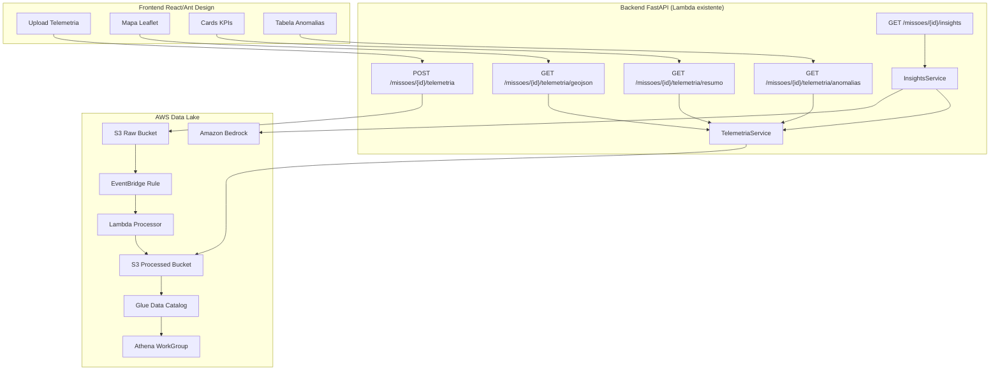
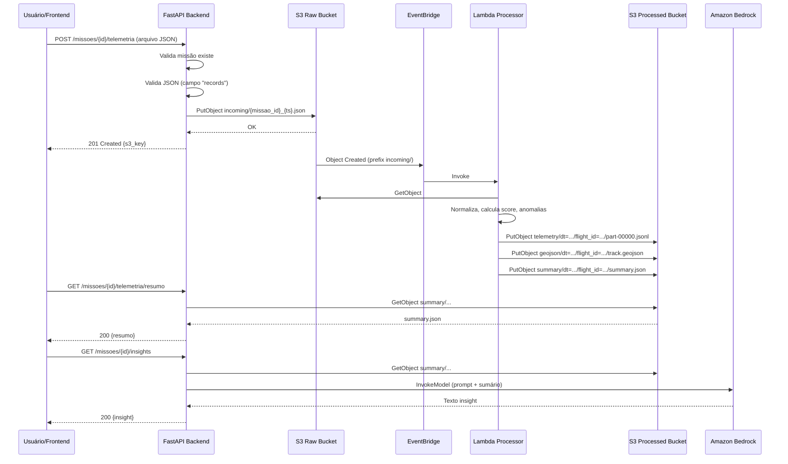

# Documento de Design — Drone Telemetry Analytics

## Visão Geral

Este documento descreve o design técnico para integração de processamento de telemetria de drones, mapas de trajeto, analytics e insights de IA ao sistema AgroFlightOps. A solução adiciona recursos de Data Lake (S3, EventBridge, Lambda, Glue, Athena) ao template SAM existente, novos endpoints REST na API FastAPI, integração com Amazon Bedrock para insights textuais, e uma aba de telemetria no frontend React/Ant Design com mapa Leaflet.

### Decisões Arquiteturais Chave

1. **Infraestrutura no template SAM existente**: Todos os recursos de telemetria (S3 buckets, Lambda Processor, EventBridge rule, Glue Database, Athena WorkGroup) serão adicionados ao `template.yaml` existente, mantendo o ciclo CI/CD unificado.

2. **Leitura direta do S3 (não Athena) para endpoints da API**: Os endpoints de consulta (`resumo`, `geojson`, `anomalias`) leem diretamente os arquivos JSON/GeoJSON do S3 Processed Bucket. Athena é reservado para analytics avançados e relatórios. Justificativa: menor latência, sem custo por query, e os dados já estão pré-computados pelo Lambda Processor.

3. **Vinculação flight_id ↔ missao_id**: O `flight_id` no S3 será o próprio `missao_id` do AgroFlightOps. No upload, o backend grava o arquivo com `missao_id` como identificador, e o Lambda Processor preserva esse ID. Isso elimina a necessidade de tabela de mapeamento.

4. **Bedrock com Claude**: Utiliza `amazon.nova-lite-v1:0` via `bedrock-runtime` para gerar insights textuais a partir do sumário de telemetria. O prompt é estruturado em português com contexto agrícola.

5. **Lambda Processor separado**: O processamento de telemetria roda em uma Lambda dedicada (não na Lambda FastAPI), acionada por EventBridge quando um objeto é criado no S3 Raw Bucket.

### Diagrama de Arquitetura



## Arquitetura

### Componentes Principais

A solução é composta por 4 camadas:

1. **Camada de Ingestão**: Endpoint de upload na API FastAPI que recebe o arquivo JSON de telemetria e o armazena no S3 Raw Bucket com metadados.

2. **Camada de Processamento**: Lambda Processor acionado por EventBridge que normaliza registros, calcula métricas (distância Haversine, score, anomalias), gera GeoJSON e grava dados particionados no S3 Processed Bucket.

3. **Camada de Consulta**: Endpoints REST na API FastAPI que leem dados processados diretamente do S3 Processed Bucket (sumário, GeoJSON, anomalias) e endpoint de insights que invoca Amazon Bedrock.

4. **Camada de Analytics**: Glue Data Catalog + Athena para consultas SQL avançadas sobre os dados JSONL particionados (views de sumário, anomalias e eficiência de pulverização).

### Fluxo de Dados



## Componentes e Interfaces

### 1. Template SAM — Novos Recursos

Recursos adicionados ao `template.yaml` existente:

| Recurso | Tipo SAM | Descrição |
|---------|----------|-----------|
| `TelemetriaRawBucket` | `AWS::S3::Bucket` | Bucket para arquivos brutos, EventBridge habilitado |
| `TelemetriaProcessedBucket` | `AWS::S3::Bucket` | Bucket para dados processados particionados |
| `TelemetriaProcessorFunction` | `AWS::Serverless::Function` | Lambda Processor Python 3.12, 512MB, 120s timeout |
| `TelemetriaEventRule` | `AWS::Events::Rule` | Regra EventBridge: Object Created no Raw Bucket prefix `incoming/` |
| `TelemetriaGlueDatabase` | `AWS::Glue::Database` | Banco Glue para tabelas de telemetria |
| `TelemetriaAthenaWorkGroup` | `AWS::Athena::WorkGroup` | WorkGroup Athena com bucket de resultados |
| `TelemetriaAthenaResultsBucket` | `AWS::S3::Bucket` | Bucket para resultados de queries Athena |
| `TelemetriaProcessorRole` | `AWS::IAM::Role` | Role IAM com permissões S3 read/write e CloudWatch Logs |

Novos parâmetros no template:
- `TelemetriaRawBucketName` (opcional, para override)
- `TelemetriaProcessedBucketName` (opcional, para override)

A Role da Lambda FastAPI existente (`LambdaExecutionRole`) receberá permissões adicionais para leitura no S3 Processed Bucket e invocação do Bedrock.

### 2. Lambda Processor — Interface

```python
# Entrada: evento EventBridge S3 Object Created
# Saída: arquivos no S3 Processed Bucket

def lambda_handler(event: dict, context) -> dict:
    """
    Processa arquivos de telemetria brutos.
    
    Input event (EventBridge):
        detail.bucket.name: str
        detail.object.key: str  # incoming/{missao_id}_{timestamp}.json
    
    Output files no S3 Processed:
        telemetry/dt={YYYY-MM-DD}/flight_id={missao_id}/part-00000.jsonl
        geojson/dt={YYYY-MM-DD}/flight_id={missao_id}/track.geojson
        summary/dt={YYYY-MM-DD}/flight_id={missao_id}/summary.json
    
    Returns:
        {"ok": True, "processed": [{"flight_id": str, "dt": str, ...}]}
    """
```

Funções internas do processor (já implementadas em `docs/Telemetria/lambda/processor/processor.py`):
- `parse_ts(value: str) -> datetime` — Parse ISO 8601 timestamp
- `haversine_m(lat1, lon1, lat2, lon2) -> float` — Distância em metros entre dois pontos
- `anomaly_reasons(row: dict) -> list[str]` — Detecta anomalias em um ponto
- `mission_score(row: dict, reasons: list[str]) -> int` — Calcula score 0–100
- `normalize_records(records: list[dict]) -> list[dict]` — Normaliza e enriquece registros
- `build_geojson(records: list[dict]) -> dict` — Gera FeatureCollection GeoJSON

### 3. API Backend — Novos Endpoints

#### Router: `app/api/telemetria.py`

```python
router = APIRouter(
    prefix="/missoes/{missao_id}/telemetria",
    tags=["Telemetria"],
)
```

| Método | Path | Descrição | Response |
|--------|------|-----------|----------|
| POST | `/missoes/{missao_id}/telemetria` | Upload arquivo telemetria | 201: `TelemetriaUploadResponse` |
| GET | `/missoes/{missao_id}/telemetria/resumo` | Sumário da missão | 200: `TelemetriaResumoResponse` |
| GET | `/missoes/{missao_id}/telemetria/geojson` | GeoJSON do trajeto | 200: GeoJSON (application/geo+json) |
| GET | `/missoes/{missao_id}/telemetria/anomalias` | Pontos com anomalia | 200: `list[AnomaliaResponse]` |

#### Router: `app/api/insights.py`

```python
router = APIRouter(
    prefix="/missoes/{missao_id}/insights",
    tags=["Insights IA"],
)
```

| Método | Path | Descrição | Response |
|--------|------|-----------|----------|
| GET | `/missoes/{missao_id}/insights` | Insights IA via Bedrock | 200: `InsightResponse` |

### 4. Services

#### `TelemetriaService`

```python
class TelemetriaService:
    def __init__(self, s3_client, raw_bucket: str, processed_bucket: str):
        ...
    
    async def upload_telemetria(
        self, missao_id: int, file_content: bytes, uploaded_by: int
    ) -> TelemetriaUploadResponse:
        """Valida JSON, armazena no S3 Raw Bucket."""
    
    async def get_resumo(self, missao_id: int) -> TelemetriaResumoResponse:
        """Lê summary.json do S3 Processed Bucket."""
    
    async def get_geojson(self, missao_id: int) -> dict:
        """Lê track.geojson do S3 Processed Bucket."""
    
    async def get_anomalias(self, missao_id: int) -> list[AnomaliaResponse]:
        """Lê JSONL do S3 Processed, filtra anomaly_count > 0."""
    
    async def _find_flight_prefix(self, missao_id: int) -> str | None:
        """Busca o prefixo dt=.../flight_id=... para uma missão."""
```

#### `InsightsService`

```python
class InsightsService:
    def __init__(self, bedrock_client, telemetria_service: TelemetriaService):
        ...
    
    async def gerar_insight(self, missao_id: int) -> InsightResponse:
        """Recupera sumário e invoca Bedrock para gerar insight textual."""
    
    def _build_prompt(self, resumo: TelemetriaResumoResponse) -> str:
        """Constrói prompt estruturado em português para o Bedrock."""
```

### 5. Frontend — Componentes

| Componente | Descrição |
|------------|-----------|
| `TelemetriaTab` | Container principal da aba Telemetria no modal de missão |
| `TelemetriaMap` | Mapa Leaflet com trajeto (LineString) e pontos coloridos por score |
| `TelemetriaKPIs` | Cards com Score Médio, Distância Total, Total Anomalias, Bateria Mínima |
| `AnomaliasTable` | Tabela Ant Design com anomalias, clique centraliza mapa |
| `TelemetriaUpload` | Componente de upload de arquivo JSON de telemetria |


## Modelos de Dados

### Schemas Pydantic — API

```python
# app/schemas/telemetria.py

class TelemetriaUploadResponse(BaseModel):
    """Resposta do upload de telemetria."""
    missao_id: int
    s3_key: str
    uploaded_at: str  # ISO 8601

class TelemetriaResumoResponse(BaseModel):
    """Sumário de telemetria de uma missão."""
    flight_id: str
    dt: str  # YYYY-MM-DD
    points: int
    distance_m: float
    avg_score: float
    min_battery: int
    anomaly_points: int

class AnomaliaResponse(BaseModel):
    """Ponto de telemetria com anomalia."""
    timestamp: str  # ISO 8601
    latitude: float
    longitude: float
    speed_mps: float
    battery_percent: int
    height_above_ground_m: float
    gps_satellites: int
    signal_strength_percent: int
    anomaly_reasons: str  # pipe-separated: "VELOCIDADE_EXCESSIVA|BATERIA_BAIXA"
    mission_score: int

class InsightResponse(BaseModel):
    """Resposta de insight gerado por IA."""
    missao_id: int
    insight: str
    model_id: str
    generated_at: str  # ISO 8601
```

### Registro Normalizado de Telemetria (JSONL)

Cada linha do arquivo JSONL contém um objeto com os seguintes campos:

| Campo | Tipo | Descrição |
|-------|------|-----------|
| `flight_id` | string | ID do voo (= missao_id) |
| `timestamp` | string | ISO 8601 com timezone |
| `dt` | string | Data YYYY-MM-DD (partição) |
| `drone_model` | string | Modelo do drone |
| `drone_serial` | string | Número de série |
| `pilot_id` | string | ID do piloto |
| `latitude` | float | Latitude WGS84 |
| `longitude` | float | Longitude WGS84 |
| `altitude_m` | float | Altitude em metros |
| `height_above_ground_m` | float | Altura acima do solo |
| `speed_mps` | float | Velocidade em m/s |
| `vertical_speed_mps` | float | Velocidade vertical |
| `heading_deg` | float | Direção em graus |
| `pitch_deg` | float | Pitch em graus |
| `roll_deg` | float | Roll em graus |
| `battery_percent` | int | Percentual de bateria |
| `battery_temp_c` | float | Temperatura da bateria °C |
| `gps_satellites` | int | Número de satélites GPS |
| `signal_strength_percent` | int | Força do sinal % |
| `spray_on` | boolean | Pulverização ativa |
| `flow_l_min` | float | Fluxo em L/min |
| `tank_level_percent` | float | Nível do tanque % |
| `coverage_width_m` | float | Largura de cobertura |
| `cumulative_distance_m` | float | Distância acumulada |
| `anomaly_count` | int | Número de anomalias |
| `anomaly_reasons` | string | Razões pipe-separated |
| `mission_score` | int | Score operacional 0–100 |

### Estrutura GeoJSON

```json
{
  "type": "FeatureCollection",
  "features": [
    {
      "type": "Feature",
      "geometry": {"type": "LineString", "coordinates": [[lon, lat], ...]},
      "properties": {
        "flight_id": "123",
        "points": 5000,
        "avg_score": 85.5,
        "distance_m": 12500.0
      }
    },
    {
      "type": "Feature",
      "geometry": {"type": "Point", "coordinates": [lon, lat]},
      "properties": {
        "timestamp": "2025-01-15T10:30:00+00:00",
        "speed_mps": 5.2,
        "battery_percent": 78,
        "spray_on": true,
        "mission_score": 92,
        "anomaly_reasons": ""
      }
    }
  ]
}
```

### Sumário JSON

```json
{
  "flight_id": "123",
  "dt": "2025-01-15",
  "points": 5000,
  "distance_m": 12500.0,
  "avg_score": 85.5,
  "min_battery": 22,
  "anomaly_points": 150
}
```

### Tabela Athena — Schema

```sql
CREATE EXTERNAL TABLE agras_telemetry_jsonl (
  flight_id string, timestamp string, drone_model string,
  drone_serial string, pilot_id string,
  latitude double, longitude double, altitude_m double,
  height_above_ground_m double, speed_mps double,
  vertical_speed_mps double, heading_deg double,
  pitch_deg double, roll_deg double,
  battery_percent int, battery_temp_c double,
  gps_satellites int, signal_strength_percent int,
  spray_on boolean, flow_l_min double,
  tank_level_percent double, coverage_width_m double,
  cumulative_distance_m double, anomaly_count int,
  anomaly_reasons string, mission_score int
)
PARTITIONED BY (dt string, flight_id_part string)
ROW FORMAT SERDE 'org.openx.data.jsonserde.JsonSerDe'
-- Projeção de partições para descoberta automática
TBLPROPERTIES (
  'projection.enabled'='true',
  'projection.dt.type'='date',
  'projection.dt.range'='2025-01-01,NOW',
  'projection.dt.format'='yyyy-MM-dd',
  'projection.flight_id_part.type'='injected'
);
```

### Prompt Bedrock para Insights

```text
Você é um analista especializado em operações de pulverização agrícola com drones DJI Agras.

Analise o seguinte resumo de telemetria de uma missão e forneça:
1. Avaliação geral da qualidade operacional (score médio e significado)
2. Análise de anomalias detectadas e possíveis causas
3. Recomendações práticas para melhorar a operação
4. Alertas de segurança se aplicável

Resumo da Missão:
- ID do Voo: {flight_id}
- Data: {dt}
- Total de Pontos de Telemetria: {points}
- Distância Total: {distance_m:.0f} metros
- Score Médio: {avg_score:.1f}/100
- Bateria Mínima: {min_battery}%
- Pontos com Anomalia: {anomaly_points} de {points}

Responda em português brasileiro, de forma objetiva e técnica.
```


## Propriedades de Corretude

*Uma propriedade é uma característica ou comportamento que deve ser verdadeiro em todas as execuções válidas de um sistema — essencialmente, uma declaração formal sobre o que o sistema deve fazer. Propriedades servem como ponte entre especificações legíveis por humanos e garantias de corretude verificáveis por máquina.*

### Propriedade 1: Rejeição de entrada inválida de telemetria

*Para qualquer* string de bytes que não seja JSON válido, ou qualquer objeto JSON que não contenha o campo `records` como lista, a validação de upload SHALL rejeitar a entrada e retornar erro, sem modificar o estado do sistema.

**Valida: Requisito 2.4**

### Propriedade 2: Distância acumulada monotonicamente não-decrescente

*Para qualquer* sequência de registros de telemetria com coordenadas válidas (latitude ∈ [-90, 90], longitude ∈ [-180, 180]), após normalização, o campo `cumulative_distance_m` SHALL ser monotonicamente não-decrescente ao longo da sequência de registros.

**Valida: Requisito 3.1**

### Propriedade 3: Score de missão limitado ao intervalo [0, 100]

*Para qualquer* registro de telemetria normalizado com valores arbitrários de velocidade, bateria, altura, satélites GPS, sinal e estado de pulverização, o `mission_score` calculado SHALL estar no intervalo [0, 100].

**Valida: Requisito 3.2**

### Propriedade 4: Detecção de anomalias é correta em relação aos thresholds

*Para qualquer* registro de telemetria normalizado, cada razão de anomalia SHALL aparecer na lista de `anomaly_reasons` se e somente se o threshold correspondente for violado (velocidade > 8 m/s → VELOCIDADE_EXCESSIVA, bateria < 20% → BATERIA_BAIXA, altura < 2m → ALTURA_BAIXA, altura > 5m → ALTURA_ALTA, satélites < 10 → GPS_FRACO, sinal < 55% → SINAL_FRACO, spray_on e flow ≤ 0.1 → PULVERIZACAO_SEM_FLUXO).

**Valida: Requisito 3.3**

### Propriedade 5: Campos do sumário são consistentes com os registros de entrada

*Para qualquer* lista não-vazia de registros normalizados, o sumário gerado SHALL ter: `points` igual ao comprimento da lista, `distance_m` igual ao `cumulative_distance_m` do último registro, `min_battery` igual ao mínimo de `battery_percent` de todos os registros, `anomaly_points` igual à contagem de registros com `anomaly_count > 0`, e `avg_score` igual à média de `mission_score` arredondada para 2 casas decimais.

**Valida: Requisito 3.6**

### Propriedade 6: Normalização de tipos é determinística

*Para qualquer* registro de telemetria bruto com campos numéricos representados como strings, inteiros ou floats, após normalização, os campos `latitude`, `longitude`, `altitude_m`, `speed_mps` SHALL ser do tipo float, e `battery_percent`, `gps_satellites`, `signal_strength_percent` SHALL ser do tipo int.

**Valida: Requisito 4.1**

### Propriedade 7: Round-trip de serialização JSONL

*Para qualquer* lista de registros normalizados válidos, serializar para JSONL (uma linha JSON por registro) e depois parsear cada linha de volta SHALL produzir objetos equivalentes aos originais.

**Valida: Requisitos 4.2, 4.3**

### Propriedade 8: Validade estrutural e round-trip do GeoJSON

*Para qualquer* lista não-vazia de registros normalizados com coordenadas válidas, o GeoJSON gerado por `build_geojson` SHALL ser um `FeatureCollection` válido contendo exatamente um `Feature` com geometria `LineString` (com coordenadas numéricas [lon, lat]) e zero ou mais `Feature` com geometria `Point`. Serializar o GeoJSON para string JSON e parsear de volta SHALL produzir um objeto estruturalmente equivalente.

**Valida: Requisitos 3.5, 4.4, 4.5**

### Propriedade 9: Completude do prompt Bedrock

*Para qualquer* sumário de telemetria válido (com todos os campos obrigatórios preenchidos), o prompt construído para o Bedrock SHALL conter os valores de `flight_id`, `dt`, `points`, `distance_m`, `avg_score`, `min_battery` e `anomaly_points` do sumário.

**Valida: Requisito 6.3**


## Tratamento de Erros

### API Backend

| Cenário | HTTP Status | Resposta |
|---------|-------------|----------|
| Missão não encontrada (missao_id inválido) | 404 | `{"detail": "Missão não encontrada", "errors": []}` |
| Telemetria não encontrada para a missão | 404 | `{"detail": "Telemetria não encontrada para a missão {id}", "errors": []}` |
| Arquivo não é JSON válido | 422 | `{"detail": "Erro de validação nos dados enviados", "errors": [{"field": "file", "message": "Arquivo não é JSON válido"}]}` |
| JSON sem campo "records" | 422 | `{"detail": "Erro de validação nos dados enviados", "errors": [{"field": "records", "message": "Campo 'records' obrigatório"}]}` |
| Falha no Bedrock (timeout, erro de modelo) | 502 | `{"detail": "Falha na geração de insights via IA", "errors": []}` |
| Falha no S3 (leitura/escrita) | 500 | `{"detail": "Erro interno ao acessar armazenamento", "errors": []}` |
| Usuário sem permissão | 403 | `{"detail": "Acesso negado", "errors": []}` |

### Lambda Processor

| Cenário | Comportamento |
|---------|---------------|
| Arquivo não parseável como JSON | Log de erro no CloudWatch, retorna `{"ok": False}`, não grava dados |
| Lista de records vazia | Log de warning, skip do arquivo, continua com próximos |
| Campo obrigatório ausente em registro | Usa valor default definido em `normalize_records` |
| Erro de escrita no S3 Processed | Exceção propagada, Lambda retry automático (até 2x via EventBridge) |
| Coordenadas inválidas (NaN, Inf) | Haversine retorna 0 para o segmento, distância acumulada não incrementa |

### Frontend

| Cenário | Comportamento |
|---------|---------------|
| API retorna 404 (sem telemetria) | Exibe mensagem "Nenhuma telemetria encontrada para esta missão" |
| API retorna erro 5xx | Exibe mensagem de erro genérica com opção de retry |
| Timeout na requisição | Exibe mensagem de timeout com opção de retry |
| GeoJSON com 0 pontos | Mapa exibido sem trajeto, KPIs zerados |

## Estratégia de Testes

### Abordagem Dual: Testes Unitários + Testes de Propriedade

A estratégia combina testes unitários (exemplos específicos e edge cases) com testes baseados em propriedades (verificação universal via inputs gerados aleatoriamente).

### Biblioteca de Property-Based Testing

- **Biblioteca**: [Hypothesis](https://hypothesis.readthedocs.io/) para Python
- **Configuração**: Mínimo de 100 iterações por teste de propriedade (`@settings(max_examples=100)`)
- **Tag**: Cada teste de propriedade deve referenciar a propriedade do design com comentário:
  `# Feature: drone-telemetry-analytics, Property {N}: {título}`

### Testes de Propriedade (PBT)

| Propriedade | Módulo Testado | Estratégia de Geração |
|-------------|----------------|----------------------|
| P1: Rejeição de entrada inválida | `app/api/telemetria.py` | `st.binary()`, `st.dictionaries()` sem "records" |
| P2: Distância monotônica | `processor.normalize_records` | `st.lists(st.fixed_dictionaries({latitude: st.floats(-90,90), ...}))` |
| P3: Score em [0, 100] | `processor.mission_score` | `st.fixed_dictionaries` com ranges amplos para cada métrica |
| P4: Anomalias vs thresholds | `processor.anomaly_reasons` | `st.fixed_dictionaries` com valores acima/abaixo de cada threshold |
| P5: Consistência do sumário | `processor.lambda_handler` (lógica de sumário) | `st.lists(normalized_record_strategy, min_size=1)` |
| P6: Normalização de tipos | `processor.normalize_records` | Records com campos como `st.one_of(st.integers(), st.floats(), st.text())` |
| P7: Round-trip JSONL | `processor.normalize_records` + JSON serialization | `st.lists(normalized_record_strategy)` |
| P8: GeoJSON válido + round-trip | `processor.build_geojson` | `st.lists(normalized_record_strategy, min_size=1)` |
| P9: Completude do prompt | `InsightsService._build_prompt` | `st.fixed_dictionaries` com campos de sumário |

### Testes Unitários

| Área | Exemplos de Teste |
|------|-------------------|
| Upload API | Upload válido retorna 201; missão inexistente retorna 404; JSON inválido retorna 422 |
| Consulta API | Resumo retorna dados corretos; GeoJSON com content-type correto; anomalias filtradas |
| Insights API | Insight gerado com sucesso; Bedrock indisponível retorna 502; sem telemetria retorna 404 |
| Lambda Processor | Processamento de arquivo sample completo; arquivo vazio; arquivo com 1 registro |
| Haversine | Distância entre pontos conhecidos (ex: São Paulo → Rio ≈ 357km) |
| Anomalias | Registro com velocidade 10 m/s → VELOCIDADE_EXCESSIVA; bateria 15% → BATERIA_BAIXA |

### Testes de Integração

| Área | Estratégia |
|------|-----------|
| Upload → S3 | Mock S3 (moto), verificar key e metadata |
| Lambda Processor → S3 | Mock S3, verificar arquivos gerados (JSONL, GeoJSON, summary) |
| API → S3 Processed | Mock S3 com dados pré-gravados, verificar leitura correta |
| API → Bedrock | Mock Bedrock client, verificar prompt e resposta |

### Testes de Infraestrutura (Smoke)

| Área | Estratégia |
|------|-----------|
| Template SAM | Validar `sam validate` passa sem erros |
| Recursos SAM | Verificar que todos os recursos de telemetria existem no template renderizado |
| Nomeação por ambiente | Verificar que recursos usam sufixo `${Environment}` |

### Testes de Frontend

| Área | Estratégia |
|------|-----------|
| TelemetriaTab | Renderiza aba com mapa, KPIs e tabela quando dados disponíveis |
| Estado vazio | Exibe mensagem quando sem telemetria |
| Loading | Exibe spinner durante carregamento |
| Interação mapa | Clique em anomalia centraliza mapa (mock Leaflet) |

### Estrutura de Arquivos de Teste

```
tests/
├── test_processor/
│   ├── test_normalize.py          # PBT: P2, P6, P7
│   ├── test_anomalies.py          # PBT: P4
│   ├── test_score.py              # PBT: P3
│   ├── test_geojson.py            # PBT: P8
│   ├── test_summary.py            # PBT: P5
│   └── test_handler.py            # Integração: Lambda handler
├── test_api/
│   ├── test_telemetria_upload.py  # PBT: P1 + unitários
│   ├── test_telemetria_query.py   # Integração: endpoints de consulta
│   └── test_insights.py           # PBT: P9 + unitários
└── conftest.py                    # Fixtures compartilhadas, strategies Hypothesis
```
