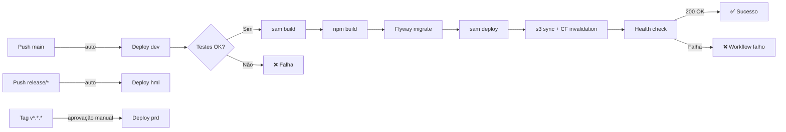
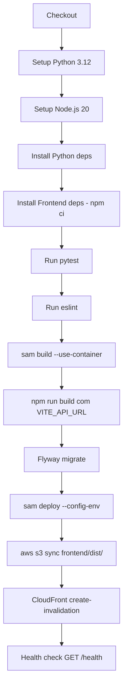

# Documento de Design — Pipeline de Build e Deploy com AWS SAM

## Visão Geral

Este documento descreve o design técnico da pipeline de build e deploy do sistema AgroFlightOps utilizando AWS SAM. A solução abrange:

- **Template SAM** (`template.yaml`): Define Lambda (FastAPI/Mangum), API Gateway HTTP, S3 + CloudFront para frontend, e IAM roles com menor privilégio
- **Configuração multi-ambiente** (`samconfig.toml`): Perfis dev, hml e prd com parâmetros independentes
- **GitHub Actions CI/CD** (`.github/workflows/deploy.yml`): Automação completa de build, teste, migração Flyway e deploy
- **Promoção controlada**: dev (push main) → hml (push release/*) → prd (tag v*.*.* com aprovação manual)

### Decisões Arquiteturais Chave

1. **SAM sobre CloudFormation puro**: SAM simplifica a definição de Lambda + API Gateway com abstrações `AWS::Serverless::Function` e `AWS::Serverless::HttpApi`, reduzindo boilerplate
2. **CloudFront com OAC (Origin Access Control)**: Substitui o legado OAI, oferecendo suporte a SSE-KMS e melhor segurança para acesso ao bucket S3 do frontend
3. **OIDC para GitHub Actions**: Elimina access keys estáticas — o workflow assume uma IAM Role via federação OpenID Connect
4. **Flyway via Docker no CI**: Executa migrações usando a imagem oficial `flyway/flyway` no GitHub Actions, conectando ao RDS via credenciais do Secrets Manager
5. **Build com `--use-container`**: Garante compatibilidade de binários nativos (aiomysql, cryptography) com o runtime Lambda Linux
6. **Infraestrutura RDS/S3 existente separada**: O template SAM NÃO recria RDS nem o bucket de documentos — referencia recursos da stack `infra/AgroFlightOps-RDS-S3.yaml` existente via parâmetros
7. **TAGs padrão obrigatórias**: Todos os recursos AWS que suportam tags devem receber 4 TAGs padrão: `Cliente` (default: VistaAgrotech), `Projeto` (default: AgroFlightOps), `Ambiente` (dev/hml/prd, default: dev), `Autor` (default: Alberto Moreira)

## Arquitetura

### Diagrama de Arquitetura Geral

```mermaid
graph TB
    subgraph "Desenvolvedor"
        GIT[Git Push / Tag]
    end

    subgraph "GitHub Actions"
        CI[CI/CD Workflow]
        CI --> TEST[pytest + lint]
        TEST --> BUILD_BE[sam build --use-container]
        TEST --> BUILD_FE[npm ci && npm run build]
        BUILD_BE --> FLYWAY[Flyway Migrate]
        FLYWAY --> DEPLOY_BE[sam deploy --config-env]
        BUILD_FE --> DEPLOY_FE[aws s3 sync]
        DEPLOY_FE --> INVALIDATE[CloudFront Invalidation]
        DEPLOY_BE --> HEALTH[Health Check /health]
    end

    subgraph "AWS — Ambiente {dev|hml|prd}"
        APIGW[API Gateway HTTP v2<br/>catch-all /{proxy+}]
        LAMBDA[Lambda Python 3.12<br/>FastAPI + Mangum]
        RDS[(RDS MySQL 8.0<br/>stack existente)]
        S3DOCS[S3 Documentos<br/>stack existente]
        S3FE[S3 Frontend Bucket<br/>static website]
        CF[CloudFront Distribution<br/>OAC + HTTPS]
    end

    GIT -->|trigger| CI
    DEPLOY_BE -->|CloudFormation| APIGW
    DEPLOY_BE -->|CloudFormation| LAMBDA
    LAMBDA -->|VPC| RDS
    LAMBDA -->|Boto3| S3DOCS
    DEPLOY_FE -->|sync| S3FE
    CF -->|OAC| S3FE
    APIGW -->|proxy| LAMBDA
```

### Diagrama de Fluxo CI/CD



### Separação de Stacks

| Stack | Arquivo | Recursos | Ciclo de Vida |
|-------|---------|----------|---------------|
| Dados e Storage | `infra/AgroFlightOps-RDS-S3.yaml` | RDS MySQL, S3 Documentos, Secrets Manager, Security Groups | Independente, já existente |
| Aplicação Serverless | `template.yaml` (SAM) | Lambda, API Gateway, S3 Frontend, CloudFront, IAM Roles | Gerenciado pelo SAM deploy |

## Componentes e Interfaces

### Estrutura de Arquivos da Pipeline

```
.
├── template.yaml                          # SAM template principal
├── samconfig.toml                         # Configuração multi-ambiente
├── .github/
│   └── workflows/
│       └── deploy.yml                     # Workflow CI/CD
├── app/                                   # Código backend (CodeUri)
│   ├── main.py                            # handler = Mangum(app)
│   └── ...
├── frontend/                              # Código frontend
│   ├── package.json
│   ├── vite.config.ts
│   └── dist/                              # Artefato de build
├── database/                              # Scripts Flyway
│   └── V{versao}__{descricao}.sql
├── requirements.txt                       # Dependências Python
└── infra/                                 # Stack existente (RDS/S3)
    └── AgroFlightOps-RDS-S3.yaml
```

### Componente 1: SAM Template (`template.yaml`)

#### Recursos Definidos

| Recurso SAM/CF | Tipo | Descrição |
|----------------|------|-----------|
| `AgroFlightOpsFunction` | `AWS::Serverless::Function` | Lambda Python 3.12, handler `app.main.handler`, 512MB, 30s timeout |
| `AgroFlightOpsApi` | `AWS::Serverless::HttpApi` | API Gateway HTTP v2, CORS configurado |
| `FrontendBucket` | `AWS::S3::Bucket` | Bucket S3 para hosting estático do frontend |
| `FrontendBucketPolicy` | `AWS::S3::BucketPolicy` | Permite acesso somente via CloudFront (OAC) |
| `CloudFrontOAC` | `AWS::CloudFront::OriginAccessControl` | Origin Access Control para S3 |
| `CloudFrontDistribution` | `AWS::CloudFront::Distribution` | CDN com cache, HTTPS, redirect SPA |
| `LambdaExecutionRole` | `AWS::IAM::Role` | Role com menor privilégio (CloudWatch, S3 docs, VPC) |

#### Parâmetros do Template

| Parâmetro | Tipo | Descrição | Exemplo dev |
|-----------|------|-----------|-------------|
| `Environment` | String | Ambiente (dev/hml/prd) | `dev` |
| `VpcSubnetIds` | CommaDelimitedList | Subnets privadas para Lambda | `subnet-xxx,subnet-yyy` |
| `VpcSecurityGroupIds` | CommaDelimitedList | Security Groups para Lambda | `sg-xxx` |
| `DatabaseUrl` | String (NoEcho) | Connection string MySQL | `mysql+aiomysql://...` |
| `JwtSecret` | String (NoEcho) | Chave secreta JWT | `***` |
| `JwtAlgorithm` | String | Algoritmo JWT | `HS256` |
| `JwtExpirationMinutes` | String | Expiração do token | `60` |
| `S3DocumentsBucket` | String | Nome do bucket de documentos existente | `agroflightops-dev-documents-...` |
| `S3Region` | String | Região do S3 | `us-east-1` |
| `CorsOrigins` | String | Origens CORS permitidas | `https://dXXX.cloudfront.net` |
| `AppEnv` | String | Variável APP_ENV | `dev` |
| `Debug` | String | Flag de debug | `true` |
| `Autor` | String | Nome do autor para TAG | `Alberto Moreira` |

#### Outputs do Template

| Output | Valor | Export |
|--------|-------|--------|
| `ApiUrl` | URL do API Gateway | `AgroFlightOps-{env}-ApiUrl` |
| `FrontendBucketName` | Nome do bucket frontend | `AgroFlightOps-{env}-FrontendBucket` |
| `CloudFrontDomainName` | Domain do CloudFront | `AgroFlightOps-{env}-CloudFrontDomain` |
| `CloudFrontDistributionId` | ID da distribuição | `AgroFlightOps-{env}-CloudFrontDistId` |

### Componente 2: Configuração Multi-Ambiente (`samconfig.toml`)

```toml
# Estrutura por ambiente
[dev.deploy.parameters]
stack_name = "agroflightops-dev"
region = "us-east-1"
confirm_changeset = false
capabilities = "CAPABILITY_IAM CAPABILITY_NAMED_IAM"
s3_prefix = "agroflightops-dev-artifacts"
parameter_overrides = "Environment=dev ..."

[hml.deploy.parameters]
stack_name = "agroflightops-hml"
# ... mesma estrutura, parâmetros de hml

[prd.deploy.parameters]
stack_name = "agroflightops-prd"
# ... mesma estrutura, parâmetros de prd
```

### Componente 3: GitHub Actions Workflow (`.github/workflows/deploy.yml`)

#### Triggers

| Evento | Branch/Tag | Ambiente | Aprovação |
|--------|-----------|----------|-----------|
| `push` | `main` | dev | Automático |
| `push` | `release/*` | hml | Automático |
| `push` (tag) | `v*.*.*` | prd | Manual (GitHub Environment `production`) |

#### Jobs e Steps



#### Secrets do GitHub

| Secret | Descrição | Uso |
|--------|-----------|-----|
| `AWS_ROLE_ARN` | ARN da IAM Role para OIDC | `aws-actions/configure-aws-credentials` |
| `DATABASE_URL_DEV` | Connection string MySQL dev | Parameter override + Flyway |
| `DATABASE_URL_HML` | Connection string MySQL hml | Parameter override + Flyway |
| `DATABASE_URL_PRD` | Connection string MySQL prd | Parameter override + Flyway |
| `JWT_SECRET_DEV` | Chave JWT dev | Parameter override |
| `JWT_SECRET_HML` | Chave JWT hml | Parameter override |
| `JWT_SECRET_PRD` | Chave JWT prd | Parameter override |

#### Autenticação AWS via OIDC

```yaml
# Configuração no workflow
- uses: aws-actions/configure-aws-credentials@v4
  with:
    role-to-assume: ${{ secrets.AWS_ROLE_ARN }}
    aws-region: us-east-1
```

Pré-requisito: IAM Identity Provider para `token.actions.githubusercontent.com` e IAM Role com trust policy para o repositório GitHub.

### Componente 4: Flyway Migrations

#### Convenção de Arquivos

```
database/
├── V1__initial_schema.sql          # Schema inicial (renomear DDL existente)
├── V2__seed_perfis.sql             # Seed de perfis
├── V3__add_indexes.sql             # Índices adicionais
└── ...
```

#### Execução no CI

O Flyway será executado via Docker no GitHub Actions:

```yaml
- name: Run Flyway Migrations
  run: |
    docker run --rm \
      -v ${{ github.workspace }}/database:/flyway/sql \
      flyway/flyway:latest \
      -url=jdbc:mysql://{host}:{port}/{db} \
      -user={user} \
      -password={password} \
      migrate
```

As credenciais de conexão são extraídas do secret `DATABASE_URL_{ENV}` e parseadas para o formato JDBC.

### Componente 5: IAM — Lambda Execution Role

#### Políticas (Menor Privilégio)

| Política | Ações | Resource |
|----------|-------|----------|
| CloudWatch Logs | `logs:CreateLogGroup`, `logs:CreateLogStream`, `logs:PutLogEvents` | `arn:aws:logs:{region}:{account}:log-group:/aws/lambda/AgroFlightOps-{env}-*` |
| S3 Documentos | `s3:GetObject`, `s3:PutObject`, `s3:DeleteObject`, `s3:ListBucket` | ARN do bucket de documentos existente + `/*` |
| VPC Access | `ec2:CreateNetworkInterface`, `ec2:DescribeNetworkInterfaces`, `ec2:DeleteNetworkInterface` | `*` (requerido pela AWS para ENI management) |

> **Nota**: As permissões VPC usam `Resource: "*"` porque a AWS exige isso para gerenciamento de ENIs. Todas as outras políticas são restritas ao ARN específico do recurso.

## Modelos de Dados

Esta feature não introduz novos modelos de dados no banco. Os artefatos de configuração são:

### Estrutura do `template.yaml` (SAM)

```yaml
AWSTemplateFormatVersion: '2010-09-09'
Transform: AWS::Serverless-2016-10-31
Description: AgroFlightOps — Backend Serverless + Frontend S3/CloudFront

Parameters:
  Environment:        # dev | hml | prd
  VpcSubnetIds:       # Subnets privadas
  VpcSecurityGroupIds: # Security Groups
  DatabaseUrl:        # NoEcho
  JwtSecret:          # NoEcho
  JwtAlgorithm:       # HS256
  JwtExpirationMinutes: # 60
  S3DocumentsBucket:  # Bucket existente
  S3Region:           # us-east-1
  CorsOrigins:        # URLs permitidas
  AppEnv:             # dev | hml | prd
  Debug:              # true | false
  Autor:              # Default: Alberto Moreira

Globals:
  Function:
    Timeout: 30
    MemorySize: 512
    Runtime: python3.12
    Tags:
      Cliente: VistaAgrotech
      Projeto: AgroFlightOps
      Ambiente: !Ref Environment
      Autor: !Ref Autor

Resources:
  # Lambda + API Gateway
  AgroFlightOpsFunction:
    Type: AWS::Serverless::Function
    Properties:
      Handler: app.main.handler
      CodeUri: .
      BuildMethod: python3.12
      VpcConfig:
        SubnetIds: !Ref VpcSubnetIds
        SecurityGroupIds: !Ref VpcSecurityGroupIds
      Environment:
        Variables:
          DATABASE_URL: !Ref DatabaseUrl
          JWT_SECRET: !Ref JwtSecret
          # ... demais variáveis
      Role: !GetAtt LambdaExecutionRole.Arn
      Events:
        CatchAll:
          Type: HttpApi
          Properties:
            ApiId: !Ref AgroFlightOpsApi
            Path: /{proxy+}
            Method: ANY

  AgroFlightOpsApi:
    Type: AWS::Serverless::HttpApi
    Properties:
      StageName: !Ref Environment
      CorsConfiguration:
        AllowOrigins: !Split [",", !Ref CorsOrigins]
        AllowMethods: ["GET","POST","PUT","PATCH","DELETE","OPTIONS"]
        AllowHeaders: ["*"]

  # Frontend S3 + CloudFront
  FrontendBucket:
    Type: AWS::S3::Bucket
    Properties:
      WebsiteConfiguration:
        IndexDocument: index.html
        ErrorDocument: index.html
      PublicAccessBlockConfiguration:
        BlockPublicAcls: true
        BlockPublicPolicy: true
        IgnorePublicAcls: true
        RestrictPublicBuckets: true
      Tags:
        - Key: Cliente
          Value: VistaAgrotech
        - Key: Projeto
          Value: AgroFlightOps
        - Key: Ambiente
          Value: !Ref Environment
        - Key: Autor
          Value: !Ref Autor

  CloudFrontOAC:
    Type: AWS::CloudFront::OriginAccessControl
    # ... signing config para S3

  CloudFrontDistribution:
    Type: AWS::CloudFront::Distribution
    # ... origin S3, cache behavior, custom error responses (403/404 → /index.html)
    # Tags aplicadas via DistributionConfig.Tags:
    #   Cliente: VistaAgrotech, Projeto: AgroFlightOps, Ambiente: !Ref Environment, Autor: !Ref Autor

  FrontendBucketPolicy:
    Type: AWS::S3::BucketPolicy
    # ... permite acesso somente via CloudFront (aws:SourceArn)

  LambdaExecutionRole:
    Type: AWS::IAM::Role
    # ... políticas de menor privilégio
    # Tags: Cliente: VistaAgrotech, Projeto: AgroFlightOps, Ambiente: !Ref Environment, Autor: !Ref Autor

Outputs:
  ApiUrl: ...
  FrontendBucketName: ...
  CloudFrontDomainName: ...
  CloudFrontDistributionId: ...
```

### Estrutura do `samconfig.toml`

```toml
version = 0.1

[default.build.parameters]
use_container = true

[dev.deploy.parameters]
stack_name = "agroflightops-dev"
region = "us-east-1"
confirm_changeset = false
capabilities = "CAPABILITY_IAM CAPABILITY_NAMED_IAM"
s3_prefix = "agroflightops-dev-artifacts"
parameter_overrides = [
  "Environment=dev",
  "AppEnv=dev",
  "Debug=true",
  # ... demais parâmetros injetados via CI
]

[hml.deploy.parameters]
stack_name = "agroflightops-hml"
# ... análogo com Debug=false

[prd.deploy.parameters]
stack_name = "agroflightops-prd"
# ... análogo com Debug=false, parâmetros de produção
```

### Estrutura do GitHub Actions Workflow

```yaml
name: AgroFlightOps Deploy
on:
  push:
    branches: [main, 'release/*']
    tags: ['v*.*.*']

permissions:
  id-token: write    # OIDC
  contents: read

jobs:
  deploy:
    runs-on: ubuntu-latest
    environment: ${{ ... }}  # dev | hml | production
    steps:
      - checkout
      - setup-python 3.12
      - setup-node 20
      - pip install -r requirements.txt
      - npm ci (frontend/)
      - pytest
      - npm run lint (frontend/)
      - sam build --use-container
      - VITE_API_URL=... npm run build (frontend/)
      - configure-aws-credentials (OIDC)
      - flyway migrate
      - sam deploy --config-env $ENV
      - aws s3 sync frontend/dist/ s3://$BUCKET --delete
      - aws cloudfront create-invalidation --distribution-id $DIST_ID --paths "/*"
      - curl health check
```


## Tratamento de Erros

### Erros no Build

| Etapa | Erro | Ação |
|-------|------|------|
| `sam build` | Dependência não encontrada em `requirements.txt` | Workflow falha, log mostra pacote faltante |
| `sam build --use-container` | Docker não disponível | Workflow falha com erro de Docker daemon |
| `npm ci` | `package-lock.json` desatualizado | Workflow falha, dev deve rodar `npm install` localmente |
| `npm run build` | Erro TypeScript / Vite | Workflow falha, log mostra erro de compilação |
| `tsc -b` | Erro de tipagem TypeScript | Workflow falha antes do Vite build |

### Erros no Deploy

| Etapa | Erro | Ação |
|-------|------|------|
| `sam deploy` | Stack em estado ROLLBACK_COMPLETE | Requer deleção manual da stack antes de re-deploy |
| `sam deploy` | Parâmetro inválido ou ausente | Workflow falha, CloudFormation reporta erro de validação |
| `sam deploy` | Timeout de criação de recurso | CloudFormation faz rollback automático, workflow captura eventos de erro |
| `s3 sync` | Bucket não existe ou sem permissão | Workflow falha, AWS CLI reporta erro de acesso |
| `cloudfront create-invalidation` | Distribution ID inválido | Workflow falha, erro reportado no log |

### Erros na Migração Flyway

| Etapa | Erro | Ação |
|-------|------|------|
| Conexão | Host/porta/credenciais inválidas | Flyway falha, deploy completo é interrompido |
| Migração | SQL com erro de sintaxe | Flyway falha, versão não é registrada, deploy interrompido |
| Migração | Conflito de versão (já aplicada) | Flyway pula versão, continua normalmente |
| Migração | Schema incompatível | Flyway falha, requer correção manual do script |

### Erros no Health Check

| Cenário | Ação |
|---------|------|
| `/health` retorna 200 | Workflow marcado como sucesso |
| `/health` retorna != 200 ou timeout | Workflow marcado como falho, notificação via output do GitHub Actions |
| Lambda cold start > timeout do curl | Retry com backoff (até 3 tentativas) |

### Estratégia de Rollback

- **Backend**: CloudFormation faz rollback automático em caso de falha no deploy. A versão anterior da Lambda permanece ativa.
- **Frontend**: O `s3 sync --delete` é irreversível. Para rollback, re-executar o workflow com o commit anterior.
- **Banco**: Flyway não suporta rollback automático em edição Community. Scripts de rollback devem ser criados manualmente como `U{versao}__{descricao}.sql` se necessário.

## Estratégia de Testes

### Por que Property-Based Testing NÃO se aplica

Esta feature é composta inteiramente por:
- **Infrastructure as Code** (SAM template / CloudFormation): configuração declarativa, não funções com entrada/saída
- **Configuração de CI/CD** (GitHub Actions workflow): YAML declarativo de pipeline
- **Scripts de deploy** (samconfig.toml, comandos AWS CLI): configuração estática

Não há lógica de aplicação, funções puras, ou transformações de dados que se beneficiem de testes baseados em propriedades. Portanto, a seção de Propriedades de Corretude é omitida.

### Abordagem de Testes

#### 1. Validação do Template SAM

| Teste | Ferramenta | Descrição |
|-------|-----------|-----------|
| Validação de sintaxe | `sam validate` | Verifica se o template é válido |
| Lint do template | `cfn-lint` | Verifica boas práticas e erros comuns do CloudFormation |
| Validação de parâmetros | Manual / checklist | Verificar que todos os parâmetros obrigatórios estão definidos |

#### 2. Testes de Integração (Deploy em dev)

| Teste | Método | Critério de Sucesso |
|-------|--------|---------------------|
| Deploy completo | `sam deploy --config-env dev` | Stack criada/atualizada sem erros |
| Health check | `curl {ApiUrl}/health` | Retorna `{"status": "ok"}` com HTTP 200 |
| Frontend acessível | `curl {CloudFrontDomain}` | Retorna HTML do React app com HTTP 200 |
| API funcional | `curl {ApiUrl}/auth/login` | Retorna resposta válida (401 sem credenciais) |
| Flyway aplicado | Verificar `flyway_schema_history` | Versão mais recente registrada |

#### 3. Testes do Workflow CI/CD

| Teste | Método | Critério de Sucesso |
|-------|--------|---------------------|
| Trigger main → dev | Push na main | Workflow executa e deploya em dev |
| Trigger release → hml | Push em release/x.y | Workflow executa e deploya em hml |
| Trigger tag → prd | Criar tag v1.0.0 | Workflow aguarda aprovação, depois deploya em prd |
| Falha de teste bloqueia deploy | Introduzir teste falhando | Workflow para antes do deploy |
| OIDC funcional | Executar workflow | `configure-aws-credentials` assume role com sucesso |

#### 4. Testes de Segurança

| Teste | Método | Critério de Sucesso |
|-------|--------|---------------------|
| S3 frontend não público | `aws s3api get-bucket-policy-status` | `IsPublic: false` |
| Lambda em VPC | Verificar configuração da função | SubnetIds e SecurityGroupIds presentes |
| IAM menor privilégio | Revisar policies da role | Sem `Resource: "*"` exceto VPC ENI |
| Secrets não expostos | Verificar logs do workflow | DATABASE_URL e JWT_SECRET mascarados |

#### 5. Checklist de Validação por Ambiente

Antes de promover para o próximo ambiente:

- [ ] Todos os testes automatizados passam (pytest + eslint)
- [ ] `sam validate` sem erros
- [ ] Deploy bem-sucedido (stack CREATE/UPDATE_COMPLETE)
- [ ] Health check retorna 200
- [ ] Frontend carrega corretamente via CloudFront
- [ ] Migrações Flyway aplicadas sem erro
- [ ] Logs do Lambda visíveis no CloudWatch
